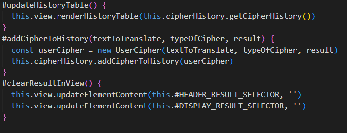

# Reflektioner kapitel 2 -11 "Clean Code"
|Kapitel|Reflektion|
|-------|----------|
|2 - Meaningful names|Detta kapitel var nog det viktigaste för mig. Koden blir så mycket lättare att förstå och läsa när man använder “Intention-Revealing Names”. Jag har tidigare haft en tendens att använda “Mental Mapping” (pwd - password, cred - credit). Formatet att tänka Klasser som substantiv och metoder som verb är också väldigt bra. Exempel på Intention-Revealing Names och metoder som verb: |
|3 - Functions|Här har jag fortfarande utmaningar. Framförallt att en funktion bara ska göra en sak. Att få funktioner små är lättare men att få en abstraktion per funktion kan vara svårare. Jag känner att jag har utvecklat “Top to Bottom” tänket och att använda beskrivande namn faller sig mer och mer naturligt efter kursen. Exempel på att en metod (registerEventListeners) gör en sak samt att använda beskrivande namn: |
|4 - Comments|Boken är ju väldigt radikal vad gäller kommentering av kod och jag kan förstå det ur perspektivet att det är bättre att skapa bra namn på klasser och metoder vilket i de flesta fall gör koden både lättare att läsa och förstå. Personligen har jag svårt att läsa t.ex. Java-kod där varje klass och metod är dokumenterad med ett gytter av asterisker och backslashes och där i princip 75 % av kommentarerna är redundanta… I min app har jag endast kommentar på två ställen och det är när jag sätter ihop en tabell som sen ska renderas i DOM:en:  Jag valde att kommentera detta då det är “bakvänd” kod som kan vara svår att förstå. Jag kanske borde refaktorerat “create table headers” och “create table body” till egna metoder, men jag valde att se “tabellen” som ett “objekt” i detta sammanhang.|
|5 - Formatting|Tack vare de inbyggda formateringsverktygen som finns i t.ex. VSCode behöver jag inte fundera så mycket på formateringen vad gäller t.ex. indrag. Däremot har boken fått mig att fundera på den vertikala “öppenheten” mellan olika koncept. Jag inser att jag är lite ovan vid detta, men när jag väl provar blir det lättare att förstå hur delar i koden hänger ihop. Att använda vertikal “densitet” känns mer naturligt. Exempel på indrag och vertikal “öppenhet” och “densitet”:  Vad gäller den horisontella delen brukar inte de verktyg jag använder i VSCode hantera det. Det är lätt att långa “oneliners” blir obegripliga, men genom att radbryta vid “punkterna” mellan metoderna blir det mycket mer lättbegripligt. Exempel på Horisontell “öppenhet” och “densitet”: |
|6 - Objects and Data Structures|Det blir lätt förvirrat när man pratar om objekt och objekt och det inte är samma sak… Hursomhelst är jag sedan tidigare  van att använda datastrukturen json för att det inte ska bli felaktiga värden och typer i de indata t.ex. ett API ska använda. I min applikation behöver jag flytta resultatet (textToTranslate, typeofCipher, result) från en användares chiffrering till en tabell med historik. Jag valde då att skapa dels en klass (model) som skapade datan från chiffreringen (UserCipher) och en klass som skapade historiken (CipherHistory). Exempel från klassen UserCipher:  Exempel från klassen CipherHistory: |
|7 - Error Handling|Som jag skrev i Laboration 2 har jag utmaningar i att använda korrekt felhantering i min kod. Jag valde därför att “omarbeta” min modul så att den istället för att skicka felkoder kastar fel. Exempel på felhantering i modulen:  Felen fångas i min app:  och renderas i vyn som ett “flash”-meddelande: Här finns utrymme för förbättringar. Jag skulle vilja skapa egna felklasser t.ex. en för varje typ av chiffrering (RovarSprakError, FikonSprakError) för att på det viset kunna hantera/separera felen enklare. Detta skulle både förenkla felsökning och testning.|
|8 - Boundaries|Det här kapitlet handlar om att tänka på de gränser som behövs när man använder tredjepartskod som t.ex. API:er. För att inte skapa beroenden in i applikationen när tredjepartskod  förändras är det oerhört viktigt att kapsla in det. Utifrån min egen kod inser jag att jag borde “kapslat in” modulen på ett bättre sätt och där t.ex. hanterat felen. Som det är nu har jag lagt till felkastningen i modulen, men hanteringen av felen sker i appen. En nyttig lärdom för framtida projekt.|
|9 - Unit Tests|Boken beskriver enhetstester och i mitt projekt gjorde jag olika i modul och app:  **Modul** Här använde jag automatiska tester med Jasmin som hade en assert per test och ett koncept per test:  **App** Här valde jag att använda manuell testning som jag presentar i en tabell med testfall, input, förväntad output och testresultat: |
|10 - Classes|För mig som kommer från funktionell programmering har den objektorienterade världen varit svår att förstå och jag har upplevt den som onödigt krånglig och tidskrävande. Därför har det varit en stor utmaning för mig att skriva den här appen i en MVC-struktur med objektorienterat fokus. Trots mina utmaningar har jag upptäckt det fina i att jobba med klasser och se till att kapsla in “hemligheter” (även om Javascript inte är ett kompilerat språk) och skapa metoder som öppnar upp de saker man vill öppna upp. Det har varit lite svårt att få in tänket med att klasserna ska vara små och bara ha ett ansvarsområde, men jag känner att jag är på god väg. Eftersom jag kodade en del av appen i HTML blir det lätt “Magiska nummer” men att skapa konstanter inom klasserna hjälpte mig med det och på det viset fick jag inga osynliga beroenden bland alla elementID” som används i appen.  Exempel på en liten klass med inkapsling:  Exempel på klass med privata konstanter: |
|1 - System|Boken diskuterar vikten av att separera delarna i koden eftersom det lätt blir komplext och man klarar inte av att hantera alla detaljer själv. Då min applikation är uppbyggd enligt MVC blir det lätt att använda "Separation of Concerns”. Att ha en main-metod visar tydligt hur applikationen “flödar”. I min applikation har jag en app.js som instansierar min Controller som startar applikationen i index.html:  I min Controller använder jag “Dependency Injection” för att koppla ihop Controllern med Modellen och Vyn:  Detta skapar flexibilitet och underlättar om man t.ex. vill testa nya vyer.|