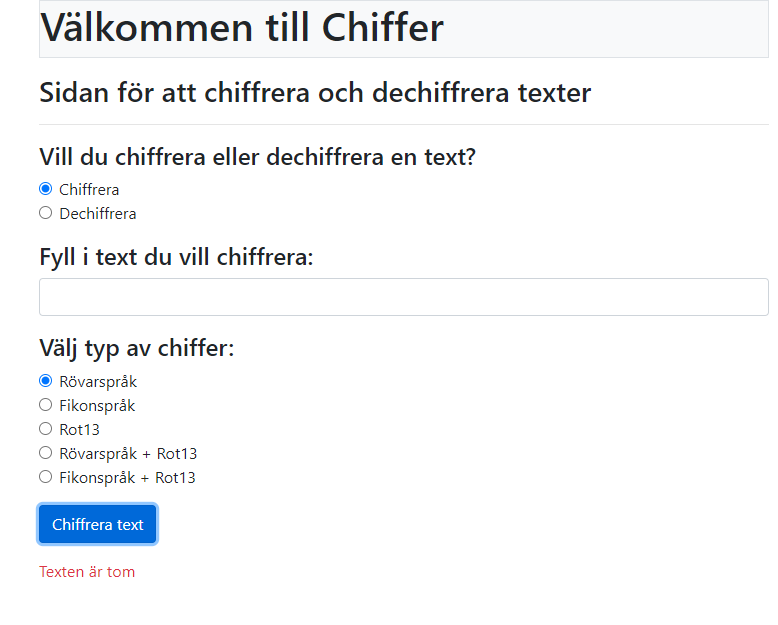
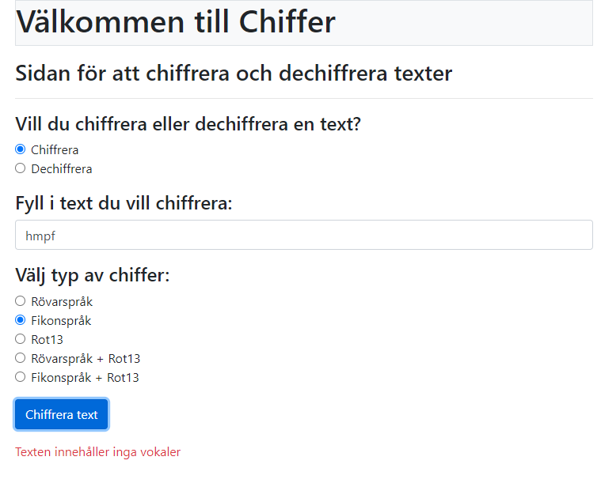
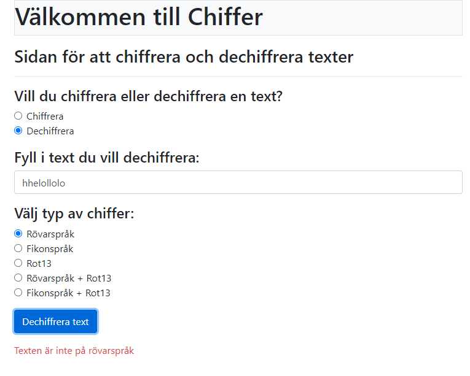
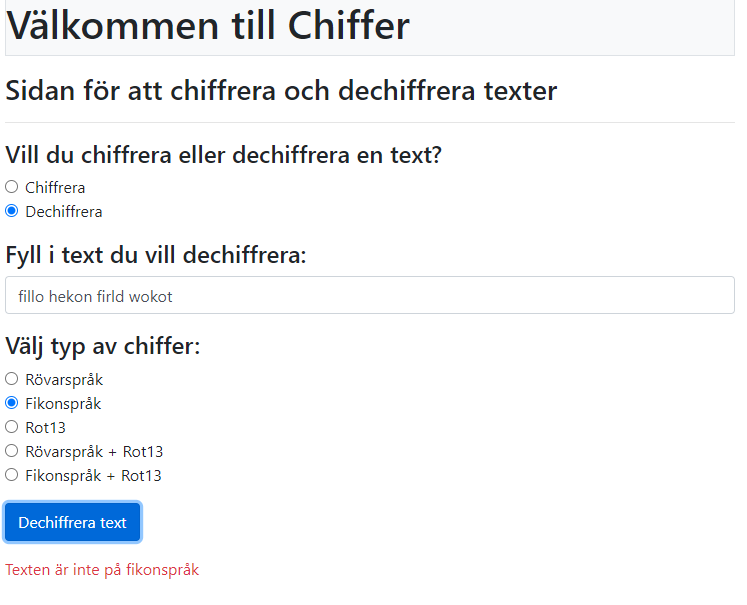
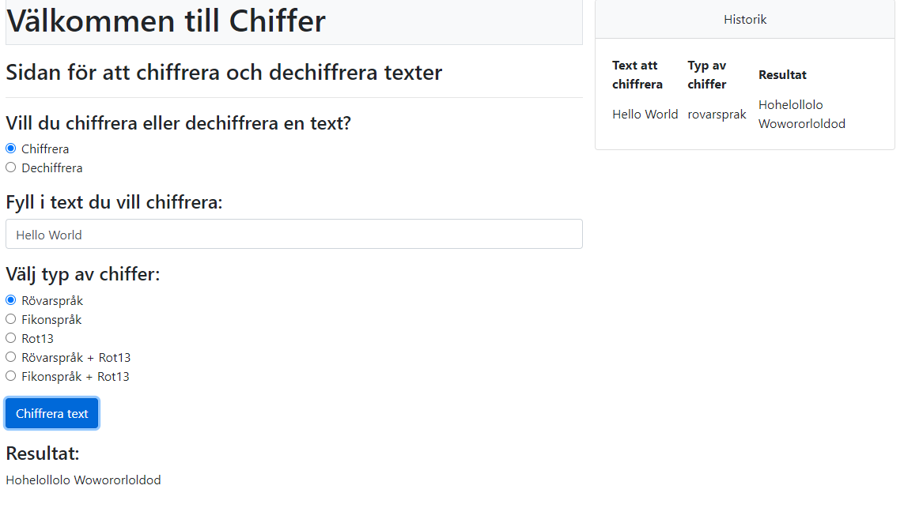
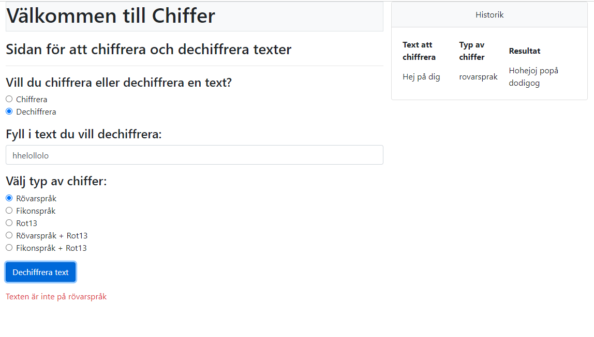
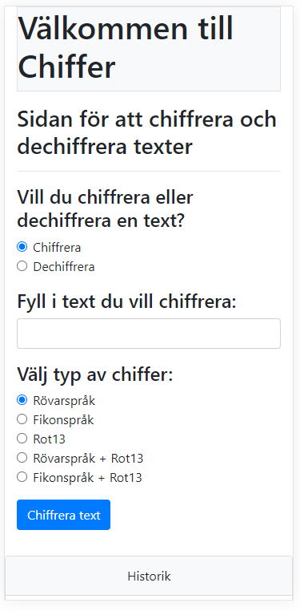

# Testrapport för appen
|Testfall beskrivning|Indata|Förväntat utfall|Testresultat|Bild på test|
|--------------------|------|----------------|------------|------------|
|Ingen text chiffreras|Tomt i fält för text, användare klickar på "Chiffrera text"|Meddelandet "Texten är tom" visas|OK||
|Text utan vokaler chiffreras till Fikonspråk|"hmpf" anges i fält för text, Användare väljer "Fikonspråk" som chiffer och klickar på "Chiffrera text"|Meddelandet "Texten innehåller inga vokaler" visas|OK||
|Text som inte är Rövarspråk dechiffreras |Användare väljer "Dechiffrera" och "hhelollolo" anges i fält för text. Användare väljer "Rövarspråk" som chiffer och klickar på "Dechiffrera text"|Meddelandet "Texten är inte på rövarspråk" visas|OK||
|Text som inte är Fikonspråk dechiffreras |Användare väljer "Dechiffrera" och "fillo hekon firld wokot" anges i fält för text. Användare väljer "Fikonspråk" som chiffer och klickar på "Dechiffrera text"|Meddelandet "Texten är inte på Fikonspråk" visas|OK||
|Historik visas i tabell|Användare väljer "Chiffrera" och anger "Hello World" i fält för text. Väljer Rövarspråk som typ av chiffer och klickar på "Chiffrera text"| Resultat "Hohelollolo Wowororloldod" visas nedan och i tabell för historik visas den senaste chiffreringen.|OK||
|Historik visas inte i tabell vid felaktig dechiffrering|Användare väljer "Dechiffrera" och "hhelollolo" anges i fält för text. Användare väljer "Rövarspråk" som chiffer och klickar på "Dechiffrera text"|Meddelandet "Texten är inte på rövarspråk" visas och hitoriken lämnas oförändrar|OK||
|Webbappen ska ha en responsiv design|Användaren använder mobil|Webbappen anpassar sig responsivt|OK||